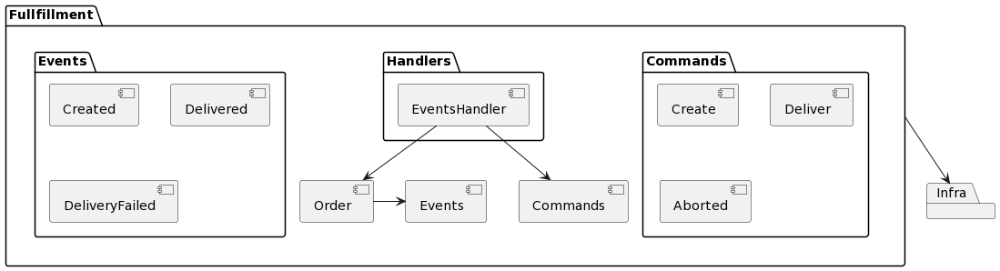

Command Sourcing
================

This gem serves as source for the Fullfillment bounded context.

Main features:
- Create An Order
- Deliver
- DeliverWithFailure

Usage:
------

Initialize like this:
```
Rails.configuration.command_bus = PersistedCommandBus::CommandBus.new
```

Then You will be able to replay the history as part of Your `Disaster Recovery Plan` like this:
`Rails.configuration.command_bus.replay_history`

Instead of doing:
```
Rails.configuration.command_bus = Arkency::CommandBus.new
```

Diagrams
--------



