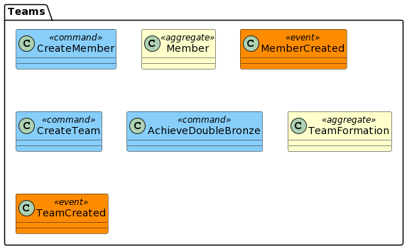

Teams
================

This gem serves as source for the Team Management bounded context.

Main features:
- Create a Team
- Create a Team Member (Move To User Management)

Diagrams
--------

- [All Domains](../../Readme.md)
